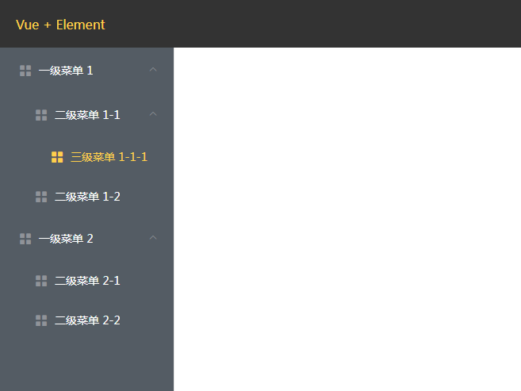

# 递归无限层级菜单组件

使用了elementUI的el-menu组件，进行了封装，传入相应的配置项，即可生成菜单，支持无限层级

## 1 菜单效果



## 2 使用方法
```js
/**
 * 第一步：
 * 首先配置好菜单项配置文件\
 * Menu/routerData.js是菜单项的配置文件
 * 该文件在Menu组件当中被引用了，实际项目当中这个菜单配置项应该根据项目情况来定
 */
import routerData from "./routerData";

// 第二步：引入Menu目录下的 Menu.vue
import Menu from "./Menu/Menu.vue";

// 第三步：页面当中使用
<template>
  <div>
    <Menu></Menu>
  </div>
</template>
```